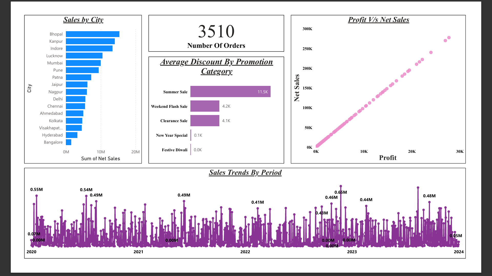
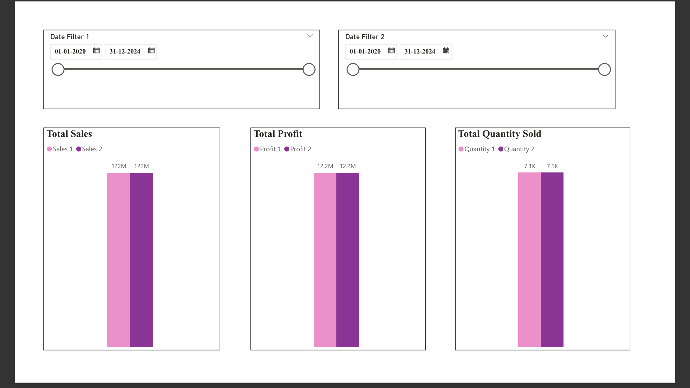

# 📊 Sales Data Analysis (Power BI)

A business dashboard project analyzing sales performance, product trends, and customer behavior based on predefined business requirements.

---

## 📌 Project Objective

To analyze sales data and build an interactive dashboard that answers key business questions related to product performance, trends, and regional sales.

---

## 📋 Business Requirements

- Identify Top/Bottom 5 products by Sales, Profit, and Quantity  
- Analyze sales trends over time (daily, monthly, yearly)  
- Understand relationship between sales and profit  
- Compare performance between different time periods  
- Evaluate average discount by category  
- Analyze sales across cities  
- Provide detailed order-level insights with filters  

---

## ⚙️ Tools Used

- Power BI  
- Power Query  
- DAX  

---

## 📊 Dashboard Preview

### 🔹 Overview Dashboard


### 🔹 Product Performance (Top/Bottom Analysis)


### 🔹 Sales Trend & Comparison


---

## 📈 Key Insights

- Certain product categories consistently drive higher sales and profit  
- Seasonal patterns influence sales trends  
- Discounts impact profitability significantly  
- Sales distribution varies across cities  

---

```
## 📁 Project Structure
sales-data-analysis/
│
├── assets/images/
├── data/
├── powerbi/
├── docs/
└── README.md
```

---

## 📌 Future Improvements

- Add forecasting for sales trends  
- Integrate real-time data source  
- Enhance dashboard interactivity  
